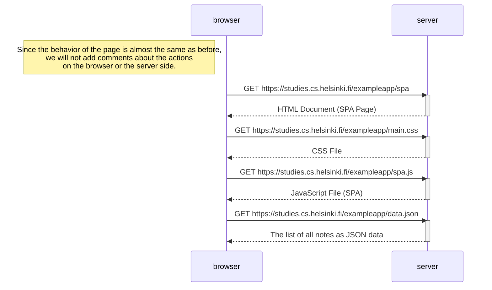

```mermaid

sequenceDiagram
    participant browser
    participant server

    Note left of browser: Since the behavior of the page is almost the same as before, <br> we will not add comments about the actions <br> on the browser or the server side.

    browser->>server: GET https://studies.cs.helsinki.fi/exampleapp/spa
    activate server
    server-->>browser: HTML Document (SPA Page)
    deactivate server

    browser->>server: GET https://studies.cs.helsinki.fi/exampleapp/main.css
    activate server
    server-->>browser: CSS File
    deactivate server

    browser->>server: GET https://studies.cs.helsinki.fi/exampleapp/spa.js
    activate server
    server-->>browser: JavaScript File (SPA)
    deactivate server

    browser->>server: GET https://studies.cs.helsinki.fi/exampleapp/data.json
    activate server

    server-->>browser: The list of all notes as JSON data
    deactivate server


```